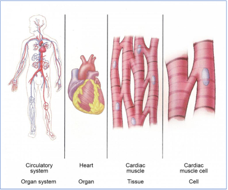
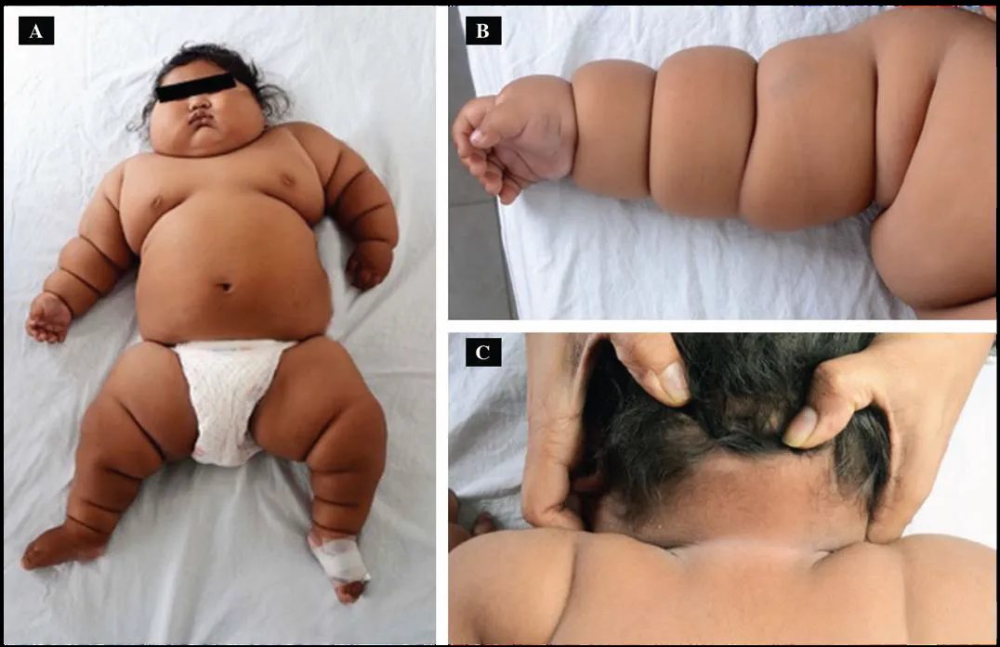

# Part I — APPETITE AND THE REGULATION (L1)

- **Section 1.1: Overview of the Course**
    1. In this course, the physiological aspects of nutrition will be introduced.
    2. The course covers how nutrients may affect humans physiologically in an organ-specific manner.
    3. Malnutrition can be interpreted as over- or under-nutrition.
    4. With a basic understanding of human anatomy and physiology, the pathophysiological impact of malnourishment will be discussed.
    5. **Gastrointestinal, renal, cardiovascular, brain and neurological systems** will be covered.
    6. Moreover, the effect of **gut bacteria** on health and the significance of **nutrition on exercise** will also be discussed.
- **Section 1.2: Overview of Human Physiology**
    - **Overview 1 - Section headings**
        1. The idea of **cell as the living units** of the body
        2. **Extracellular Fluid** — The “internal Environment”
        3. “**Homeostatic Mechanisms**” of the major functional systems
            1. Homeostasis
            2. Origin of nutrients in the extracellular fluid
            3. Removal of metabolic end products
            4. Regulation of body functions
        4. Control systems of the body
            1. The feedback and nature
    - **Overview 2 - What is physiology?**
        1. Goal: explain the **physical and chemical factors** that are responsible for the origin, development and progression of life
        2. To explain the specific characteristics and mechanisms of the human body that make it a living being
        3. Fact: we remain alive is almost beyond our control (**automation**):
            1. Hungry→ seek for food
            2. Fear→ seek for refuge
        4. An **automation** of sensing, feeling, and then knowledgeable beings
    - **1** Cells as living units
        
        
        
        
        **Cell**
        • Basic living unit of body
        • Specifically adapted to perform 1 (or few) functions 
        ***e.g.*** RBC: transport O$_2$ lungs → tissues
        
        **Organ**
        Aggregate of different cells held by intracellular supporting structures
        
        Although many cells of the body often **differ** markedly from one another, all of them have certain **basic characteristics** that are alike.
        
        - Same metabolic pathways *i.e.* same general chemical mechanisms for changing nutrients → energy
        
        <aside>
        💡
        
        </aside>
        
    - **2**.1 Extracellular fluid as the internal environment
        
        
        
        **Extracellular fluid**
        
        - **Constant motion** (flow) throughout the body
        - Contains **ions & nutrients** needed by the cells to maintain cell life, *i.e.* all cells live in essentially the same environment — the extracellular fluid
        - Creates an **internal environment** by supporting proper concentrations of oxygen, glucose, different ions, amino acids, fatty substances and other constituents are available in this internal environment
        
        <aside>
        💡
        
        **Composition**: 60% fluid  1/3 ECF
        
        </aside>
        
    - 2.2 Difference between extracellular and intracellular fluids
        
        
        
        
        Special mechanisms for **transporting ions through the cell membranes** maintain the ion concentration differences between the extracellular and intracellular fluids.
        
        Extracellular fluid consists of
        
        - **Plasma** 
        intravascular fluid;
        blood without cells
        - **Interstitial fluid**
        fluid that fills intracellular spaces
        
        |  | ECF | ICF |
        | --- | --- | --- |
        | Ions | Large amounts of  Na$^+$, Cl**$^-$**and HCO$_3{ }^{ -}$ (bicarbonate) | Large amounts of   K$^+$, Mg$^{2+}$ 
        & PO$_4{ }^{ -}$(phosphate) |
        | Nutrients | O$_2$, glucose, fatty acids and amino acids |  |
        | Waste Products | CO$_2$ (cells → lungs for excretion)
        Others → kidneys for excretion |  |
        
        <aside>
        💡
        
        </aside>
        
    - **3**.1 Homeostatic mechanisms in major functional systems
        
        
        
        **Definition:**
        
        1. Maintenance of nearly constant conditions in the internal environment
        2. All organs and tissues of the body perform functions that help maintain these constant conditions
            
            ***e.g.***
            
            - Lungs provide O$_2$ to ECF for replenishment of those used by cells
            - Kidneys maintain constant ion concentrations
            - Gastrointestinal system provides nutrients
        
        <aside>
        💡
        
        </aside>
        
    - 3.2 Extracellular fluid transport and mixing system — blood circulatory system
        
        
        
        
        **Blood circulation in body**
        
        **Stage**
        
        Extracellular fluid is transported through body in **2 stages**:
        
        1. Movement of blood in blood vessels
        2. Movement of fluid between the blood capillaries and intracellular spaces between the tissue cells.
        
        **Speed**
        
        All blood in circulation traverse the entire circulatory circuit at an average of
        
        - **1 time per min** (at rest)
        - ~**≥ 6 times per min** (extremely active)
        
        **Exchange of materials between plasma and interstitial fluid**
        
        1. As blood passes through capillaries, **continual** exchange of ECF occurs between plasma and interstitial fluid simultaneously
        2. Walls of capillaries are **permeable** to most molecules in plasma, except large plasma proteins and blood cells
        3. Large amounts of fluid and dissolved constituents diffuse **back and forth** between blood and tissue spaces
        4. Fluid and dissolved molecules are continually moving and bouncing in **all directions** within plasma and interstitial fluid + through capillary pores
        
        <aside>
        💡
        
        </aside>
        
    - 3.3 Origin of nutrients in the extracellular fluid
        
        
        **Respiratory system**
        
        When blood passes through **lungs**, O$_2$ is picked up in the **alveoli**
        
        
        
        **GI tract, liver and metabolic organs**
        
        1. **GI tract**: Dissolved nutrients (carbohydrates, fatty acids and amino acids) are absorbed from ingested food into plasma
        2. **Liver** changes chemical compositions of most absorbed nutrients to more usable forms (for itself) and other tissues
        
        
        
        **Musculoskeletal system**
        
        1. Body movement for **acquisition of food** at appropriate place and time
        2. Provides motility for **protection** against adverse surroundings
        
        
        
        <aside>
        💡
        
        </aside>
        
    - 3.4 Removal of metabolic end products
        
        
        **Lungs**
        
        1. Simultaneously when blood picks up O$_2$, CO$_2$ is released from blood into alveoli
        2. CO$_2$ is the most abundant end products of metabolism
        
        
        
        **Kidneys**
        
        1. Remove most substances besides CO$_2$ including urea, excess ions and water from food
        2. Most of these substances are **POORLY reabsorbed** and pass through renal tubules into urine
        
        
        
        <aside>
        💡
        
        </aside>
        
    - **4**.1 Regulation of body functions — Nervous system
        
        
        **Sensory input** — Sensory receptors detects state of body or the surroundings
        
        **The central nervous system** — composed of brain and spinal cord, which they integrate information, process them and generates thoughts of responses
        
        **Motor output** — Appropriate signals are transmitted through the motor output portion of the nervous system to carry out one’s desires
        
        
        
        A large segment of the nervous system is called the **autonomic system —** Operates at **subconscious level** and controls many functions of internal organs 
        
        ***e.g.*** 
        
        **(i)** Heartbeat
        
        **(ii)** Movements of GI tract
        
        **(iii)** Secretion from most body glands
        
        <aside>
        💡
        
        </aside>
        
    - 4.2 Regulation of body functions — Hormonal system
        
        **Hormones** — A system of regulation that **complements nervous system** (hypothalamus)
        
        1. 8 major endocrine glands that secret hormones
        2. Hormones are transported in ECF to whole body to regulate cellular function
        
        
        
        Endocrine glands
        
        ***e.g.***
        
        **(i) Thyroid hormone —** ⬆️ rates of most chemical reactions in cells
        
        **(ii) Insulin** **—** controls glucose metabolism
        
        **(iii) Adrenocortical hormones** **—** control Na$^+$, K$^+$ and protein metabolism
        
        **(iv) Parathyroid hormone** **—** controls bone Ca$^{2+}$ and PO$_4$$^-$ (affect bone density)
        
        <aside>
        💡
        
        </aside>
        
    - 5 Control systems of the body — Overview
        
        
        1. Body has thousands of control systems
        2. Most intricate of these are **genetic control systems** that operate in all cells to control intra- and extracellular functions
        
        
        
        ***e.g.***
        
        **(i) Respiratory system** **—** operates in association with the nervous system, regulates CO$_2$ concentration in ECF
        
        **(ii) Liver and pancreas** **—** regulate concentration of glucose in ECF
        
        **(iii) Kidneys —** regulate concentration of H$^+$, Na$^+$, K$^+$, PO$_4$$^-$ and other ions in ECF
        
        <aside>
        💡
        
        </aside>
        
    - **5**.1 Characteristics of Control System — **Negative feedback** nature
        
        
        
        
        Most control systems of the body act by `-ve` feedback 
        
        ***e.g.***  **CO$_2$ conc. in ECF**
        
        1. High conc. CO$_2$ in ECF ⇒ ⬆️ pulmonary ventilation
        2. Lungs expire greater amounts of CO$_2$ from body ⇒ 🔻conc. CO$_2$ in ECF
        3. High conc. CO$_2$ in ECF initiates events that 🔻conc. towards normal, which is NEGATIVE/OPPOSITE to the initiating stimulus
        4. Conversely, if conc. CO$_2$ too low ⇒ feedback to ⬆️ the concentration (also negative to initiating stimulus)
        
        In general, if some factor becomes excessive or deficient, control system initiates `-ve` feedback: a series of changes that return the factor toward a certain mean value, thus **maintaining homeostasis**
        
        <aside>
        💡
        
        </aside>
        
    - 5.2 **Positive feedback** can sometimes cause vicious cycles and even death
        
        **Q:** Why do essentially all control systems of the body operate by **negative** feedback rather than positive feedback?
        
        **A:** `+ve` feedback ❌ lead to stability but to instability and often death
        
        **Severe Condition** — **2L blood loss** 🩸 (*fig*)
        
        Low blood vol. hinder effective pumping of heart  
        ⇒🔻Arterial pressure  
        ⇒🔻Blood flow to heart 
        ⇒ Muscle through the coronary vessels diminishes ⇒ Weakening of the heart  
        ⇒ Further 🔻 pumping 
        ⇒ **Vicious cycle** repeats until death
        
        ***Note:*** each cycle in the feedback results in further weakening of heart, in other words, the initiating stimulus causes more of the same, which is a positive feedback.
        
        
        
        💗 normally pumps about 5L blood/min in healthy adult
        
        **Mild** degree of positive feedback **can be overcome** by negative feedback control
        mechanisms so vicious cycle fails to develop
        
        **Mild** **Condition** — **1L blood loss** 🩸(*fig*)
        
        Normal negative feedback mechanisms for controlling cardiac output & arterial pressure would overbalance the positive feedback → recovery (**dashed curve)** 
        
        <aside>
        💡
        
        </aside>
        
    - 5.3 Positive feedback can sometimes be useful
        
        In some instances, the body use positive feedback to its advantage.
        
        ***e.g.* Blood clotting**
        
        - When blood vessel ruptured and clot begins to form, multiple enzymes (**clotting factors**) activated within the clot
        - Some of these enzymes act on other un-activated enzymes of immediately adjacent blood  ⇒ more blood clotting
        - Continues until hole in vessel is plugged & bleeding stops
        
        
        
        <aside>
        💡
        
        </aside>
        
    - **6 Interim Summary — Automaticity of the body**
        - Overall organization of the body
        - The means by which different parts of the body operate in harmony
        1. The body is a social order of **~100 trillion cells** organized into different functional structures, some of which are called organs
        2. Each functional structure contributes to the maintain homeostatic conditions in ECF (the internal environment)
        3. When normal conditions are maintained, cells of the body continue to live and function properly
        4. Each cell benefits from homeostasis and contributes toward maintenance of homeostasis
        5. This **reciprocal interplay** provides continuous automaticity of body until ≥ 1 functional systems lose their ability to contribute to this stability
        6. When this happens, all cells of the body suffer: 
        **Extreme** **dysfunction** → death  **Moderate dysfunction** → sickness (potentially be recovered)
        
        <aside>
        💡
        
        </aside>
        
    
    **Concept check (True of false)**
    
    - [ ]  1. Physiology is to explain the physical and chemical factors responsible for the development and progression of life, it is an automated process.
    - [ ]  2 Extracellular fluid is static outside the cells
    - [ ]  3 Extracellular fluid contains large amounts of potassium and phosphate ions
    - [ ]  4 The circulatory system is essential for extracellular fluid transport
    - [ ]  5 The origin of nutrients in the extracellular fluid is from our GI tract only.
    - [ ]  6 There are eight major glands in the body under the regulation by the hypothalamus
    - [ ]  7 Negative feedback involves a series of changes that return the factor towards back to a certain value of homeostatic point.
    - [ ]  8 Positive feedback never occurs in a healthy person under physiological conditions
    
    <aside>
    💡
    
    1T; 2F; 3F; 4T; 5F; 6T; 7T; 8F 
    
    </aside>
    
- **Section 1.3: Physiology, Appetite, and Weight Regulation**
    - 1 Introduction
        
        
        
        
        Rising number of obesity and diabetes
        
        
        
        1. Food intake & energy balance — an integral part of life
        2. Obesity & diabetes — an emerging epidemic in modern world (ultra-processed food → hedonic)
        3. Understanding weight & appetite regulation mechanism for 
        **(i)** Pathogenesis of obesity
        **(ii)** Targets for current & future therapies in weight management
        4. Homeostatic control of weight by balancing food intake & energy expenditure
        5. Current research identified central and peripheral regulatory mechanism of weight and appetite by identifying **neuronal pathways** and **hormones** secreted by the gut and adipocytes
        
        <aside>
        💡
        
        </aside>
        
    - 2 Issues of concern related to obesity and diabetes
        1. Research field of obesity is relatively new
        2. Significant progress in unravelling neuronal pathways: these circuits work with input from endocrine system, autonomic nervous system and gut hormone
        3. During human evolution, **cortico-limbic system** (prefrontal cortex, amygdala & hippocampus) used to adapt behavior to precure food supply for maintaining healthy weight & energy balance
        4. Modern world — abundant food supply in affluent cities likely overwhelm regulatory system
        5. Recent discovery of gut hormones, gut microbes and their interactions with central regulatory pathways have paved the way for metabolic surgery for obesity
        
        <aside>
        💡
        
        </aside>
        
    - 3 Organ systems involved in weight regulation
    - 3.1 Cortical-limbic system
        - **Overview of cortical-limbic system**
            
            
            1. Brain regions involved
                - **Frontal cortex**
                - Hippocampal formation
                - Basolateral amygdala
                - **Hypothalamus** and thalamus
                - Olfactory bulb
            
            
            
            1. Essential neuronal system for weight & energy balance throughout
            evolution
            2. Significance in providing cues about food procurement as a conservatory
            measure
            
            <aside>
            💡
            
            </aside>
            
        - **Frontal cortex**
            
            
            1. Regulatory & control center of behavior *e.g.* food intake
            2. Governs food choice
            3. Damage or pathology cause disinhibition of food intake
            
            
            
            Disturbance of this modality may explain **poor food choice** and **non-adherence to therapeutic interventions** in obesity.
            
            ***e.g.*** 
            
            1. **Gourmand syndrome** — damage to the ***right*** frontal cortex ⇒ passion for eating & talking about fine foods
            2. **Frontotemporal dementia** — ***right*** frontal atrophy 萎縮 associated with hyperphagia **食慾過盛** and weight gain | ***left*** frontal atrophy associated with weight loss
            3. **Klein-Levin syndrome** — rare syndrome with excessive sleepiness, compulsive overeating, and behavioral disturbance; evidence of **hypoperfusion** (decreased blood flow) of the ***right*** frontal lobe
            4. **Right frontal lobe epilepsy 癲癇** (abnormal brain activity) — **overactivity** of ***right*** frontal lope region leads to **anorexia**, and it resolves after therapy with anti-epileptics
            
            
            
            
            
            <aside>
            💡
            
            Right → appetite suppression
            
            </aside>
            
        - **Hypothalamus**
            
            
            1. Vital role in maintaining
            energy balance by regulating food intake and energy expenditure
            2. **Signal integration center**
            3. Sends out from the cortex, limbic system & autonomic nervous system
            4. Receives inputs from GI
            tract, pancreas, liver and adipocytes; has **bidirectional** communication and coordination with these systems
            
            
            
            <aside>
            💡
            
            </aside>
            
        - **Arcuate nucleus of hypothalamus 下丘腦弓狀核**
            
            
            
            1. Vital to energy homeostasis and regulation of weight and appetite
            2. Located next to an area with **fenestrated capillaries (have additional holes)**, which allows the **passage of peripheral hormonal signals** through blood-brain barrier and **receiving neuronal input**
            3. Functional antagonistic systems in arcuate nucleus in regulating appetite
                - **POMC** (pro-opiomelanocortin) & **CART** (cocaine- and amphetamine-regulated transcript) — appetite-suppressing (**anorexigenic**) (anorexia nervosa)
                - **NPY** (Neuropeptide Y) & **AgRP** (Agouti Related Protein) — appetite-stimulating (**orexigenic**)
            
            <aside>
            💡
            
            Insulin (produced after eating) 
            activate anorexigenic; leptin produced by fat cell (full of triglycerides) both anoxi- and suppress orexi so more potent effect than insulin
            
            </aside>
            
        - **Hormonal regulation of the antagonistic system**
            
            
            
            **Melanocortin - intrahypothalamic peptide**
            
            Appetite is regulated by complex feedback loop involving endocrine signals
            originated in **peripheral tissues** and **intrahypothalamic peptides**
            
            |  | Origin | Orexigenic
            **NPY/AgRP** neurons  | Anorexigenic 
            **melanocortin** neurons  |
            | --- | --- | --- | --- |
            | Leptin | Fat tissue (3.2) | 🚫 | 🌟 |
            | Insulin | Pancreas (3.3) | 🚫 | 🌟 |
            | Ghrelin (hunger) | Stomach (3.4) | 🌟 | / |
            | PYY$_{3-36}$ | Colon (3.4) | 🚫 | / |
            
            🚫 Inhibition 🌟Stimulation
            
            <aside>
            💡
            
            </aside>
            
        - **Hedonic** 享樂 **control of appetite-food reward pathway**
            
            
            
            1. Food and drug reward pathway seems to converge within the limbic system
            2. Mediated by the dopaminergic pathway: ⬆️ **dopaminergic stimulus** by foods with high sugar/fat content (similar to drug reward and addiction)
            3. Modern world: abundant supply of food + less incentive for physical activity than premodern era during evolutionary history
            4. **Competition** between **homeostatic ↔️ hedonistic drive** ⇒ dysregulation of energy balance
            
            <aside>
            💡
            
            Dopamine - neurotransmitter related to addiction
            
            </aside>
            
    - 3.2 The adipocyte
        - **Overview of the adipocyte**
            
            
            
            1. Responsible for insulation, mechanical support and energy balance
            2. Found in subcutaneous region (usu. good) and visceral (inside abdomen; usu. bad associated with chronic inflammation) area
            3. Surplus food +/ low energy expenditure ⇒ stored as triglyceride
            4. During starvation +/ high energy expenditure ⇒ triglyceride → free fatty acids + glycerol
            5. The brown adipose tissue — responsible for energy expenditure via **adaptive thermogenesis**, as it has an **abundance of mitochondria** consisting of uncoupling protein-1 (**UCP-1**) (produce heat from ATP rather than just ATP) 
                - UCP-1 makes brown adipose tissue capable of oxidizing substances to produce heat (thermogenesis)
            
            <aside>
            💡
            
            People living in polar regions have more brown fat
            
            </aside>
            
        - **The brown adipocyte**
            
            
            
            1. **Adaptive** thermogenesis — respond to food and **cold exposure**
            2. In adults, brown adipose tissue is found in the **supraclavicular region (neck)** and **upper trunk**. 
            3. The sympathetic nervous system (also responsible for shivering) promotes brown tissue mediated thermogenesis, increased insulin sensitivity, improved glucose disposal, and free fatty acid oxidation
            4. Some white adipose tissue may be capable for expressing UCP-1 by a process called **browning**: imparts brown adipose tissue-like capacity for energy expenditure
                - Browning is mediated by adrenergic stimulation, thyroid hormone, stress and exercise
            
            <aside>
            💡
            
            </aside>
            
        - **The fat derived leptin in regulation of appetite**
            
            **Normal condition**
            
            1. Leptin is produced by 
                - **Adipocytes** (mainly)
                - Gastric mucosa and enterocytes
            
            
            
            1. Focusing on adipocytes, leptin is produced in proportion to fat mass ⇒ serves as marker of energy stores (if fat tissue bigger; more leptin is produced)
            2. **Triglycerides** stores in fat cells determine level of leptin secretion
            3. Leptin receptors are located in CNS including hypothalamus
            4. In brain, leptin signals satiety, and its level is reduced in starvation, making hypothalamus sends signals for food intake by increasing appetite
            
            <aside>
            💡
            
            </aside>
            
            **Pathological conditions**
            
            Obese people: higher leptin levels but have leptin **RESISTANCE;** receptor desensitized - more leptin is required to trigger the response
            
            
            
            **Congenital leptin deficiency** - Clinical photos of patient showing (A) generalized body fat distribution, (B) deep skin folds and (C) acanthosis nigricans 黑色棘皮症
            
            |  | **Pathology** |  **Leptin therapy**  |
            | --- | --- | --- |
            | **Congenital leptin deficiency** | Rare syndrome characterized by hyperphagia, obesity and hypo-gonadotrophic hypogonadism (small sex organ) | ✅ |
            | **Leptin receptor deficiency syndrome** | (similar as above) | ❌ |
            | **Lipodystrophy** | Absence of functional adipocytes ⇒ low leptin levels 
            ⬆️ appetite and **insulin resistance** | ✅ |
            
            <aside>
            💡
            
            </aside>
            
    - 3.3 Pancreatic hormones
        
        **Insulin**
        
        1. Secreted by the **β-cells** of pancreas, also secreted in proportion to body fat
        2. Suppresses appetite by 🚫 AgRP/NPY neurons, through not as potent as leptin (previous - arcuate nucleus)
        3. Obese subjects do not experience central weight loss effect despite higher levels of insulin owing to insulin resistance
        
        **Pancreatic polypeptide**
        
        1. Secreted by **F cells** in response to calorie intake; low level are seen in caloric restriction
        2. Slows gastric emptying and suppresses appetite by 🚫 NPY/AgRP
        3. Pathologically, low levels seen in obesity and **Prader Willi Syndrome**
        
        
        
        
        
        **Amylin**
        
        1. Co-secreted with insulin from the pancreatic **beta cells**
        2. Increases leptin and insulin sensitivity, slows gastric emptying, and inhibits hepatic gluconeogenesis by **suppressing glucagon production**
        
        <aside>
        💡
        
        </aside>
        
    - 3.4 Brain-gut connection
        - **Overview**
            
            
            During food intake:
            
            1. Brain stem receives information from **taste receptors** when food enters oral
            cavity
            2. Different parts of the brain receive **olfactory signals** of food odor — **hedonic drive** of eating
            3. **Mechanoreceptors** from the GI tract also signal the brain via **vagal stretch receptor** about the potential arrival of nutrients (bulking of stomach from filling by food)
            4. Gut nutrient signals from **hormones (*e.g.* leptin, insulin)** transcend through
            blood-brain barrier and **vagal afferent signals** reaching hypothalamus
            
            
            
        - **Ghrelin (Hunger hormone; orexigenic)**
            
            
            
            1. Mucosa of empty stomach secrets ghrelin, ingestion of food suppresses its **release**
            2. Actions are both central and peripheral
            3. Ghrelin suppression varies with **food type** (protein *vs* fat *vs* carbs) and fluctuates with **circadian rhythm**
            4. May be partly responsible for **hedonistic drive** through food reward mechanism involving dopaminergic pathway
            
            <aside>
            💡
            
            </aside>
            
        - **Cholecystokinin 膽囊收縮素**
            
            
            
            1. Released from the upper intestine (duodenum and jejunum) in response to **protein and fat**
            2. Suppresses food intake by sending central signal to hypothalamus
            3. Slows gastric emptying, stimulates gallbladder contractions.
        - **Incretins 腸促胰島素 - Factors released from the intestine in response to nutrients**
            
            
            
            **Glucagon-like peptide-1 (GLP1)**
            
            - Secreted from the **L cells** of ileum and colon by (i) direct contact with nutrients (fat, protein and glucose) and (ii) neuronal input from the upper intestine
            - Satiety effect by reaching the hypothalamus
            - Stimulates glucose-dependent release of insulin from pancreas, slows gastric emptying
            
            **PYY (Peptide YY)**
            
            - Secreted by the **L cells** in the ileum and colon
            - With a similar effect on suppressing food intake
            
            **Glucose-dependent insulinotropic polypeptide**
            
            - Similar to GLP1 but secreted from **K cells** in the proximal duodenum in response to glucose and fat (fat > glucose)
            - Promotes fat storage in form of triglycerides
            
            <aside>
            💡
            
            </aside>
            
        - **Gut microbiome**
            
            
            
            1. There has been considerable research emphasis linking the gut microbiome to health and disease, and obesity is no exception.
            2. Association between the diversity of gut bacterial species ↔️ obesity
            3. Obese individuals tend to have **higher firmicutes to bacteroid** ratio compared with non-obese subjects (affected by food intake & *maybe* chronic inflammation)
            4. One of the hypotheses about associating microbiota with obesity could be that the gut microbiome in obese subject maybe contributing to weight gain by **increased energy harvesting** from nutrients
            
            <aside>
            💡
            
            Hypothesis now; need more research
            
            </aside>
            
    - 4 Regulation of energy expenditure
        
        
        1. Body maintains a set point for weight and fat mass, known as adiposity, by regulating food intake and energy expenditure
        2. 3 major components of energy expenditure
            - Resting energy expenditure (basal metabolic rate)
            - Thermogenic effect of food (more heat produced after eating)
            - Physical activity induced energy expenditure
        
        
        
        **SNS**: Sympathetic nervous system
        
        <aside>
        💡
        
        </aside>
        
        **Resting energy expenditure (BMR; blue portion)**
        
        1. BMR is the biggest component of total energy expenditure to maintain body functioning
        2. Includes sleeping & arousal-related energy expenditure
        3. Determined by age (old lower), sex (male higher), body composition (muscle higher) & genetic traits
        4. Fat-free mass is the strongest predictor of resting metabolic rate
        5. ~5% of the BMR is utilised to maintain arousal
        6. Environmental and internal body temperature also affect BMR
        
        **Thermogenic effect of food and physical activity-induced energy expenditure (green and red portion)**
        
        Thermogenic effect of food
        
        1. 8-10% of total energy consumed is used to process food (produce enzymes; movement of GI tract)
        2. Varies based on food consumption —
        carbohydrate 5-10%, fat 0-3%, protein 20-30%
        
        Physical activity-induced energy expenditure
        
        - Most variable component of energy expenditure — varies from 15% (very sedentary) to 50% (highly active)
        - Combines energy expenditure from **(i)** voluntary exercise and **(ii)** spontaneous activity, including non-exercise activity thermogenesis (**NEAT**) *e.g.* walking
        - NEAT is proportionate to spontaneous activity (fidgeting), which is likely regulated by orexin **食慾素** (neuropeptide that regulates arousal, wakefulness and appetite) via action in hypothalamus
            - Higher NEAT, lesser risk of weight gain
        
        <aside>
        💡
        
        </aside>
        
    - 5 Clinical significance and conclusion
        1. The first line of therapy for weight management — lifestyle change and behavior modification which may involve cognitive behavioral therapy
        2. It is also important:
            - To identify the **adverse risk factor*** contributing to change in weight or appetite
            - To consider patients’ food preferences, cultural influences, resources for healthy food procuring and whether a food reward mechanism (**addiction**) is involved
        3. Interrogating a person’s daily routine and dietary habits gives clues to weight gain risk factors, including food choice, physical activity, psychosocial stressors, work environment and sleep pattern
        4. Patients can benefit from a referral to a dietitian for nutritional counselling and/or a psychologist for cognitive behavioral therapy for behavioral change.
        5. The pharmacotherapy for weight management is based on our understanding on physiology of energy balance
        6. Surgical options will only be made available when lifestyle modification and pharmacotherapy fail to achieve desired weight loss
        
        <aside>
        💡
        
        *Adverse risk factor ***e.g.*** socio-economical conditions (“food dessert” exposure to fast food >> fresh food) also important factor driving lifestyle of people
        
        </aside>
        
    - **Concept check (True of false)**
    - [ ]  1 Hypoactivity of right side of the frontal lobe results in weight loss
    - [ ]  2 Anorexia is associated with hyperactivity of the right side of the frontal lobe
    - [ ]  3 Hypothalamus talks to the peripheral metabolic organs and the GI tract by receiving signals from them only
    - [ ]  4 Signals from the peripheral like the insulin and leptin regulate the anorexigenic and orexigenic responses in the hypothalamus
    - [ ]  5 POMC and CART promotes appetite
    - [ ]  6 Appetite regulation is an example of negative feedback mechanism involving the crosstalk between the hypothalamus and the peripheral tissues
    - [ ]  7 Leptin is released from adipocytes, determined by the triglyceride stores in these cells.
    - [ ]  8 Leptin resistance is associated with reduced leptin production
    - [ ]  9 Physical and mechanical presence of food in the GI tract contributes input to the brain gut connection
    - [ ]  10 Different species of microbes inside the intestine modulates the risk of obesity and other cardiovascular diseases
    - [ ]  11 Sleeping does not consume energy from the body
    - [ ]  12 More energy is needed by the body to process protein than carbohydrates
    
    <aside>
    💡
    
    1F 2T 3F 4T 5F 6T 7T 8F 9T 10T 11F 12T
    
    </aside>